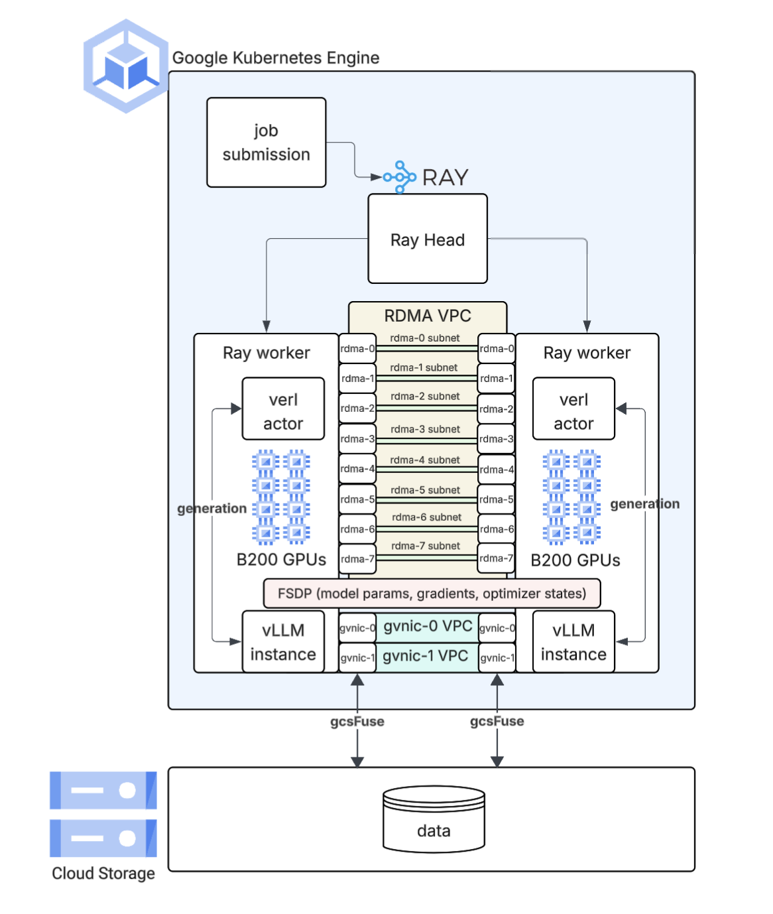
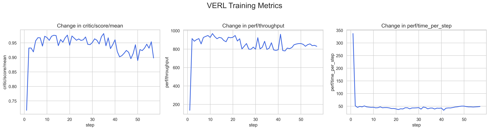

## 1. Overview
This repository provides a guide and toolkit for fine-tuning state-of-the-art large language models (LLMs) using Reinforcement Learning (RL). The solution leverages verl's RL framework, running on a distributed Ray cluster deployed on Google Kubernetes Engine (GKE). The guide currently works for spot B200s and H200s on GCP, DWS will be contributed soon (But can easily be adapted in the meantime).

The primary goal is to enhance model performance on specific tasks by applying the GRPO (Generative Rejection Policy Optimization) algorithm. This process has been tested with the Qwen 2.5 family of models, but should be extendable to other popular OSS LLMs supported by verl. 

This example is validated on the GSM8K dataset.

The architecture is designed for scalability and efficiency, utilizing Google Cloud Storage with gcsfuse configured for optimal storage performance and dedicated GPU resources for the RL pipeline.

## 2. Architecture
The training infrastructure is built on a Ray cluster deployed on GKE, featuring a head node and multiple worker nodes. With verl we are demonstrating a co-located configuration. The diagram below illustrates a co-located setup



For more about how GRPO works in verl you can refer to verl's public documentation here: https://verl.readthedocs.io/en/latest/algo/grpo.html

## 3. Setup 

Follow the below steps to setup the GKE cluster and Ray cluster. 

Clone repo 
```bash
git clone https://github.com/esaaren/verl-on-gke.git && cd verl-on-gke
```

Set root 
```bash
export REPO_ROOT=`git rev-parse --show-toplevel`
```

Source environment and then navigate to setup. Make sure to update the environment variables to be suitable to your own environment and situation 
```bash
source $REPO_ROOT/.env 
cd $REPO_ROOT/setup && ./setup.sh 
```

Setup gcs fuse
```bash
source $REPO_ROOT/k8s
kubectl apply -f storage.yaml
```

Quick NCCL test to validate RDMA/networking deployment on the spot nodepool. Wait a couple minutes for the spot nodes to come online 

```bash
cd $REPO_ROOT/utils 
kubectl apply -f nccl_test.yaml

kubectl exec nccl-test-host-1 -it -- /bin/bash -c " /usr/local/gib/scripts/run_nccl_tests.sh -t all_gather -b 1K -e 8G nccl-host-1 nccl-host-2"
```

The output should look like:
```bash
NCCL version 2.26.6+cuda12.8
#
#                                                              out-of-place                       in-place          
#       size         count      type   redop    root     time   algbw   busbw #wrong     time   algbw   busbw #wrong
#        (B)    (elements)                               (us)  (GB/s)  (GB/s)            (us)  (GB/s)  (GB/s)       
        1024            16     float    none      -1    43.34    0.02    0.02      0    42.48    0.02    0.02      0
        2048            32     float    none      -1    42.80    0.05    0.04      0    42.42    0.05    0.05      0
        4096            64     float    none      -1    43.10    0.10    0.09      0    42.85    0.10    0.09      0
        8192           128     float    none      -1    44.48    0.18    0.17      0    44.14    0.19    0.17      0
       16384           256     float    none      -1    46.17    0.35    0.33      0    45.51    0.36    0.34      0
       32768           512     float    none      -1    47.93    0.68    0.64      0    47.57    0.69    0.65      0
       65536          1024     float    none      -1    48.31    1.36    1.27      0    48.15    1.36    1.28      0
      131072          2048     float    none      -1    50.06    2.62    2.45      0    50.38    2.60    2.44      0
      262144          4096     float    none      -1    50.99    5.14    4.82      0    52.18    5.02    4.71      0
      524288          8192     float    none      -1    54.63    9.60    9.00      0    55.29    9.48    8.89      0
     1048576         16384     float    none      -1    63.77   16.44   15.41      0    63.85   16.42   15.40      0
     2097152         32768     float    none      -1    84.46   24.83   23.28      0    79.28   26.45   24.80      0
     4194304         65536     float    none      -1    94.15   44.55   41.77      0    94.28   44.49   41.71      0
     8388608        131072     float    none      -1    107.9   77.76   72.90      0    107.1   78.35   73.46      0
    16777216        262144     float    none      -1    140.4  119.46  111.99      0    137.4  122.13  114.50      0
    33554432        524288     float    none      -1    152.6  219.83  206.09      0    154.7  216.88  203.33      0
    67108864       1048576     float    none      -1    236.2  284.13  266.37      0    234.7  285.96  268.09      0
   134217728       2097152     float    none      -1    415.7  322.90  302.72      0    411.0  326.59  306.18      0
   268435456       4194304     float    none      -1    742.9  361.35  338.77      0    762.0  352.27  330.25      0
   536870912       8388608     float    none      -1   1412.5  380.09  356.34      0   1403.5  382.53  358.62      0
  1073741824      16777216     float    none      -1   2767.0  388.05  363.80      0   2749.2  390.57  366.16      0
  2147483648      33554432     float    none      -1   5429.5  395.52  370.80      0   5413.8  396.67  371.87      0
  4294967296      67108864     float    none      -1    10757  399.29  374.33      0    10736  400.06  375.05      0
  8589934592     134217728     float    none      -1    21395  401.49  376.40      0    21381  401.75  376.64      0
# Out of bounds values : 0 OK
# Avg bus bandwidth    : 135.094 
```

## 4. Running GRPO with verl 
This repo uses uv running from a local workstation so some slight modification in the below run commands might be needed.

Create a uv venv 
```bash
uv venv --python 3.12 --seed
source .venv/bin/activate
uv pip install uv 
```

Download the model weights and place them on your GCS bucket. Can modify the below commands / directories as needed. 
```bash
curl -LsSf https://hf.co/cli/install.sh | bash

hf download Qwen/Qwen2.5-32B-Instruct 

gcloud storage cp -r /Users/$USER/.cache/huggingface/hub/models--Qwen--Qwen2.5-32B-Instruct gs://$GSBUCKET/huggingface_cache/hub
```

Clone the repo and process the GSM8K dataset and then place them on the GCS bucket
```bash
cd $REPO_ROOT
git clone https://github.com/verl-project/verl.git && cd verl 
uv pip install verl
python3 examples/data_preprocess/gsm8k.py --local_save_dir ~/data/gsm8k
gcloud storage cp ~/data/gsm8k/* $GSBUCKET 
```

Create the Ray operator
```bash
helm repo add kuberay https://ray-project.github.io/kuberay-helm/
helm repo update
helm install kuberay-operator kuberay/kuberay-operator --version 1.5.1
```

Create the Ray cluster
```bash
cd $REPO_ROOT/k8s 
kubectl apply -f ray_cluster_setup.yaml
```

In another terminal, port forward to the head node
```bash
kubectl port-forward svc/b200-ray-cluster-head-svc 8265:8265
```

Now we can run the GRPO job
```bash
cd $REPO_ROOT/job
uv tool run --index-url https://pypi.org/simple ray -- job submit \
    --address "http://localhost:8265" \
    --runtime-env runtime-env.yaml \
    -- \
    bash -c "
        # 3. Launch PPO Training
        cd /data/verl && PYTHONUNBUFFERED=1 python3 -m verl.trainer.main_ppo \
        data.train_files=/data/gsm8k/train.parquet \
        data.val_files=/data/gsm8k/test.parquet \
        data.train_batch_size=256 \
        data.max_prompt_length=512 \
        data.max_response_length=512 \
        actor_rollout_ref.model.path=Qwen/Qwen2.5-32B-Instruct \
        actor_rollout_ref.actor.optim.lr=1e-5 \
        actor_rollout_ref.actor.ppo_mini_batch_size=256 \
        actor_rollout_ref.actor.ppo_micro_batch_size_per_gpu=64 \
        actor_rollout_ref.rollout.name=vllm \
        actor_rollout_ref.rollout.log_prob_micro_batch_size_per_gpu=8 \
        actor_rollout_ref.rollout.tensor_model_parallel_size=8 \
        actor_rollout_ref.rollout.gpu_memory_utilization=0.6 \
        actor_rollout_ref.ref.log_prob_micro_batch_size_per_gpu=4 \
        actor_rollout_ref.actor.strategy=fsdp2 \
        algorithm.kl_ctrl.kl_coef=0.001 \
        trainer.logger=console \
        trainer.val_before_train=False \
        trainer.n_gpus_per_node=8 \
        trainer.nnodes=2 \
        trainer.save_freq=10 \
        trainer.test_freq=10 \
        algorithm.adv_estimator=grpo \
        actor_rollout_ref.rollout.n=8 \
        trainer.total_epochs=2" 2>&1 | tee verl_demo.log
```

You should see our verl_demo.log being written out locally, you're welcome to also use the W&B integration with verl to write there as well. The logs will look something like below (after a somewhat lengthy setup)

```bash
(TaskRunner pid=2860) step:32 - global_seqlen/mean:37335.0 - actor/entropy:0.071 - actor/grad_norm:0.082 - critic/score/mean:0.959 - response_length/mean:184.58 - timing_s/step:46.59 - perf/throughput:801.42 - perf/mfu/actor:0.31
...
``` 

I provided a simple plot script as well (plot_training.py) so you can visualize the results of the training using the verl_demo.log (Can skip this if using W&B or other viz tools). A sample plot looks something like:

